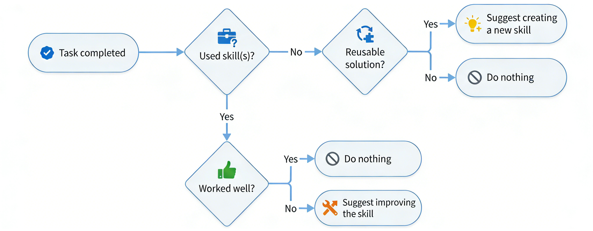

<div align="center">

# ⚡ Auto-agent-skills

**为你的 AI Agent 自动构建可复用的个人技能库。**

[English](./README.md) | 中文版

[](./LICENSE)
[](https://nodejs.org/)
[](https://modelcontextprotocol.io/)

*一个 MCP 服务器，帮助 AI Agent 自动发现、创建并持续改进可复用的技能 — 全程自动化。*

</div>


---

## ✨ 功能特性

| 特性 | 描述 |
|:---|:---|
| **自动搜索** | 任务开始前，自动在公开技能生态中搜索最匹配的技能并安装 |
| **自动回顾** | 任务完成后，评估解决方案是否值得封装为可复用技能 |
| **智能建议** | 仅在新技能或改进真正有用时才会提示，不产生干扰 |
| **持续改进** | 若使用的技能表现不佳，根据实际问题提出针对性改进建议 |
| **个人技能库** | 在 `~/.autoskills/personal-skills/` 维护一套专属的、带版本控制的技能文件夹 |
| **多 Agent 支持** | 支持 Windsurf、Cursor、Claude Code 及任何 MCP 兼容的 Agent |

---

## 🚀 快速开始

### 1. 安装

```bash
git clone https://github.com/YOUR_USERNAME/Autoskills.git
cd Autoskills
npm install
npm run build
```

### 2. 配置你的 Agent

将 Autoskills MCP 服务器添加到你的 Agent 配置中：

```json
{
  "mcpServers": {
    "auto-agent-skills": {
      "command": "node",
      "args": ["<path-to-autoskills>/dist/index.js"],
      "env": {
        "AUTOSKILLS_DIR": "<path-to-your-home>/.autoskills/personal-skills"
      }
    }
  }
}
```

`AUTOSKILLS_DIR` 用于指定这个 MCP 创建的个人技能存储目录。

### 3. 开始使用

Agent 会全程自动处理：

1. **任务开始前** — 若任务可能存在匹配的公开技能，Agent 调用 `search_skill` 搜索并安装
2. **任务执行中** — Agent 以安装的技能为指导完成任务
3. **任务完成后** — Agent 调用 `review_task`，决定是创建新技能还是改进已有技能

---

## 🔧 MCP 工具

| 工具 | 调用时机 | 功能 |
|:---|:---|:---|
| `search_skill` | 任务执行前 | 搜索公开技能生态，安装最优结果，创建软链接 |
| `review_task` | 任务完成后 | 评估解决方案，建议创建或改进技能 |
| `create_skill` | 创建新技能时 | 将新技能写入个人技能库并链接 |
| `update_skill` | 改进技能时 | 更新已有技能的指令、描述或元数据 |
| `list_skills` | 按需调用 | 列出个人技能库中的所有技能 |
| `get_skill` | 按需调用 | 读取某个技能的完整内容 |

---

## 📚 个人技能库

技能以 Markdown 文件形式存储在 `~/.autoskills/personal-skills/`：

```
~/.autoskills/personal-skills/
├── web-scraping/
│   └── SKILL.md
├── docker-setup/
│   └── SKILL.md
└── react-component/
    ├── SKILL.md
    ├── scripts/
    └── references/
```

每个 `SKILL.md` 包含：

```markdown
---
name: skill-name
description: 用于匹配和触发的简短描述
---

# 技能标题

## 何时使用
触发条件和适用场景。

## 指令
Agent 遵循的逐步工作流程。
```

技能同时软链接到 `~/.agents/skills/`，可被任意 Agent 全局使用。

---

## 🛠️ CLI（可选）

一个用于无需 Agent 即可管理技能的小型 CLI：

```bash
npx autoskill init <skill-name>      # 创建新技能模板
npx autoskill add <path> [-y]        # 添加技能并创建软链接
npx autoskill remove <skill-name>    # 删除技能及其软链接
npx autoskill list                   # 列出所有个人技能
```

---

## 💡 使用场景

| 场景 | 工作方式 |
|:---|:---|
| **重复性任务** | Agent 任务前搜索匹配的公开技能，使用后评估质量 |
| **全新解决方案** | Agent 完成任务后，建议将方案封装为新的个人技能 |
| **技能表现不佳** | Agent 检测到使用技能时出现问题，建议针对性改进 |
| **手动创建技能** | 使用 `npx autoskill init` 生成技能模板，自行填写内容 |
| **技能共享** | 技能为纯 Markdown 文件，可跨机器或项目复制、链接 |

---

## 📄 许可证

[MIT](./LICENSE)
